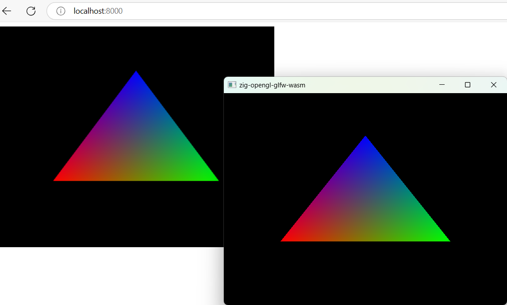

# zig-opengl-glfw-wasm
Draw triangle with OpenGL+GLFW or webgl2.

zig version 0.13.0



## Dependencies
glfw

## Run

```sh
zig build run
```

## Build wasm

```sh
zig build -p web -Dtarget-web
python3 -m http.server --directory ./web
```
